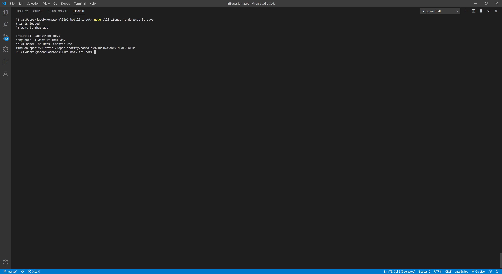

# liri-bot
 LIRI is like iPhone's SIRI. However, while SIRI is a Speech Interpretation and Recognition Interface, LIRI is a Language Interpretation and Recognition Interface.
 
 lIRI is a node command line application that takes a command (song movie ect.) and outputs info from an api.
 LIRI also uses the npm package <a href="https://www.npmjs.com/package/inquirer" target="_blank">inqurer.</a>
 
 
 Commands using inqurer:
 
Run the file node (fileName.js)
You will see a prompt asking You to input a function

Functions:

- spotify-this-song,
(when a song is entered if runs thruogh the spotify api and displays infomation on the song)

- movie-this,
(when a movie is entered the runs through the omdb api and displays infomation on the movie)

- concert-this
(when a band/singer name is entered the runs through the bandsintown api and displays infomation on the band/singer)

After You enter a function You will be pormped to enter a value.

If You enter the function spotify-this-song You will enter the name of a song for the value.

If You enter the movie-this function You will enter the name of a movie for the value.

If You enter the concert-this function You will enter the name of a singer or band for the value.

After you enter a function and a value You will see infomation on what You entered.

EX. If You use the spotify-this-song function You the App will search the spotify API and return infomation of the song including a spotify link to the album the song is in.
You will see the pictures below for a screenshot of the output of all of the functions.
Side note if you leave the value blank it will show a preset output.
Bonus if You enter node (fileName.js) do-what-it-says You will see a the song: I Want it That Way in spotify format.
Here is a <a href="https://youtu.be/Tu2cmcbT_rM" target="_blank">video</a> showing all of the functions 

Dependencys used:
- <a href="https://www.npmjs.com/package/inquirer" target="_blank">inquirer</a>
- node-spotify-api
- axios
- moment

Images:

movie-this Function:

concert-this Function:

spotify-this-song Function:

do-what-it-says Function (no inquirer)

